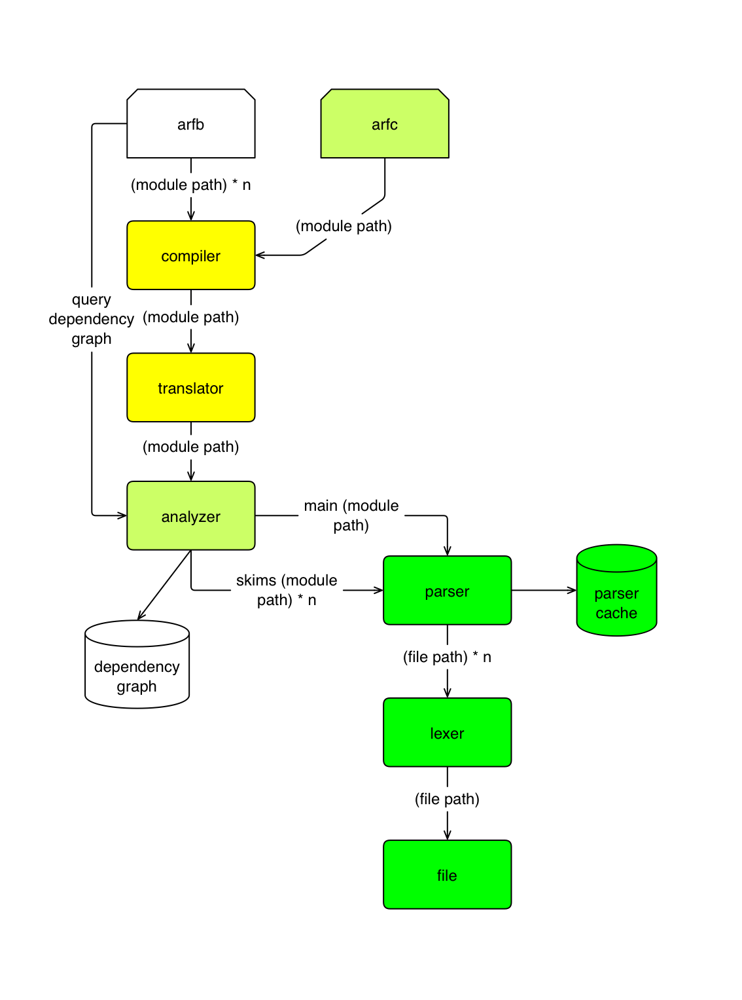

# 

This repository is no longer being developed. The ARF language has since gone through several revisions and has been given a different name (FSPL), and the new version can be found [here](git.tebibyte.media/fspl/fspl).

README of this repository:

The ARF programming language.

This is still under development and does not compile things yet. Once complete,
it will serve as a temporary compiler that will be used to write a new one using
the language itself.

The old repository can be found [here](https://github.com/sashakoshka/arf-old).

ARF is a low level language with a focus on organization, modularization, and
code clarity. Behind it's avant-garde syntax, its basically just a more refined
version of C.

A directory of ARF files is called a module, and modules will compile to object
files (one per module) using C as an intermediate language (maybe LLVM IR in the
future).

Be sure to visit the [wiki](https://git.tebibyte.media/arf/arf/wiki) for more
information.

## Planned Features

- Type definition through inheritence
- Struct member functions
- Go-style interfaces
- Generics
- A standard library (that can be dynamically linked)

## Checklist

- [X] File reader
- [X] File -> tokens
- [X] Tokens -> syntax tree
- [ ] Syntax tree -> semantic tree
- [ ] Semantic tree -> C -> object file
- [ ] Figure out HOW to implement generics
- [ ] Create a standard library

## Compiler Progress

- Yellow: needs to be completed for the MVP
- Lime: ongoing progress in this area
- Green: Already completed
